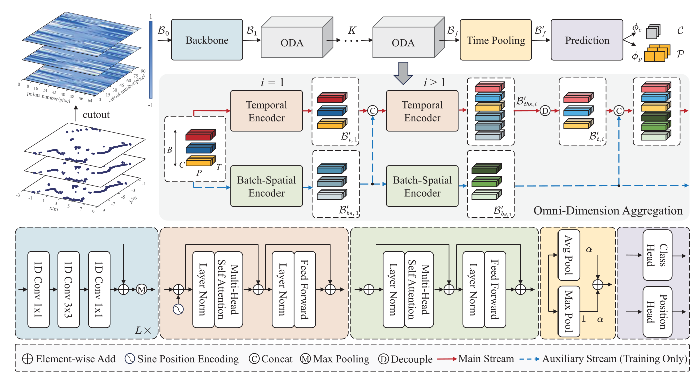

# Li2Former-v1

This is the official code for paper `Li2Former: Omni-Dimension Aggregation Transformer for Person Detection in 2-D Range Data`.

# Introduction

The sparsity of plane point clouds remains human
detection based on 2-D LiDAR a challenging task. Recent deep-
learning-based methods have made significant progress, but their
unidimensional feature modeling hinders the flow of informa-
tion across different axes (i.e., temporal, spatial, and batched).
Besides, convolution operators limit the effective receptive field
(ERF) of the model. To promote multidimensional interaction,
we propose an omni-dimensional aggregation (ODA) module
composed of a main aggregation stream and an auxiliary feature
stream to assist in the temporal–spatial joint encoding as well
as implicitly models the potential relationships between samples.
By cascading multiple ODA blocks, the semantic gaps between
different features are gradually bridged. In addition, to improve
network convergence and generalization, an adaptive focus mech-
anism (AFM) is designed to guide the model to optimize more
on difficult samples instead of simple or low-quality samples.
Extensive experiments demonstrate the effectiveness of the pro-
posed pipeline, achieving 76.4% and 81.4% AP on the DROW
and JRDB benchmark datasets, respectively, surpassing the exist-
ing state-of-the-art (SOTA) results. Competitive results are also
achieved in inference speed. Furthermore, we successfully vali-
date the proposed model through real-world environments.




# Result

### DROW Dataset

$\mathrm{Method}$ | $\mathrm{AP}_{0.3}$ | $\mathrm{AP}_{0.5}$ | $\mathrm{Peak-F_1}$| $\mathrm{EER}$ | $\mathrm{GFLOPs}$ | $\mathrm{FPS}$
|--|--|--|--|--|--|--|
ROS leg detector    | 0.239 | 0.273 | 0.367| 0.335 | - |18.7
Arras (re-trained)  |  0.413        |     0.437        |     0.476          |     0.460        |   -             |24.5 
Leigh (re-trained)  |  0.480        |  0.552           |   0.563            |  0.557           |   -             | 25.4
DROW($T=1$)         |  0.677         |  0.685          |  0.658     |     0.652       |     11.37          | **83.7**
DROW($T=5$)         |   0.679        |   0.698      |  0.656     |   0.651       |   27.09          |  72.0 
  \+ pseudo labels  | 0.711         |   0.726         |  0.691     |  0.685          |   27.09            | 72.0
DR-SPAAM            |   0.676        |     0.699       |  0.677     |    0.671        |  11.38             |  81.4 
  \+ pseudo labels  |0.698        |     0.711       |  0.710      |    0.708        |  11.38             | 81.4
Li2Former($T=5$)    |  0.704            | 0.748 | 0.700            | 0.696               | **10.55**            | 66.9 
Li2Former-A($T=5$)  | **0.725**| **0.764** | **0.720** | **0.718**              | **10.55**            | 66.9  


### JRDB Dataset

$\mathrm{Method}$ | $\mathrm{AP}_{0.3}$ | $\mathrm{AP}_{0.5}$ | $\mathrm{Peak-F_1}$| $\mathrm{EER}$ | $\mathrm{GFLOPs}$ | $\mathrm{FPS}$
|--|--|--|--|--|--|--|
ROS leg detector    | 0.285   | 0.363         | 0.453          |   0.450    |   -             | 5.8
Arras (re-trained)  |  0.376    |     0.445     |     0.487      |   0.484    |   -             | 7.6
Leigh (re-trained)  |  0.337      |   0.521     |   0.553          | 0.552      |   -             | 12.0
DROW($T=1$)         | 0.696 | 0.732 | 0.682| 0.676| **13.80**| **78.3**
DROW($T=5$)         | 0.723 | 0.765 | 0.714| 0.709 | 32.87| 58.5
\+ pseudo labels    | **0.753** | 0.786 | 0.732 | 0.728| 32.87 | 58.5 
DR-SPAAM            |0.721| 0.768 | 0.718 | 0.713 |14.91 |  75.2 
\+ pseudo labels    | 0.744   | 0.787 | 0.728 | 0.728  |14.91 |  75.2
Li2Former($T=5$)    | 0.740          | 0.796 | 0.744           | 0.742            | 19.25       |57.0
Li2Former-A($T=5$)  | 0.749          | **0.814** | **0.750**            | **0.746**               | 19.25            | 57.0 

# Citing us
```
@article{0Li2Former,
  title={Li2Former: Omni-Dimension Aggregation Transformer for Person Detection in 2-D Range Data},
  author={ Yang, Haodong  and  Yang, Yadong  and  Yao, Chenpeng  and  Liu, Chengju  and  Chen, Qijun },
  journal={IEEE Transactions on Instrumentation and Measurement},
  volume={73},
}
```